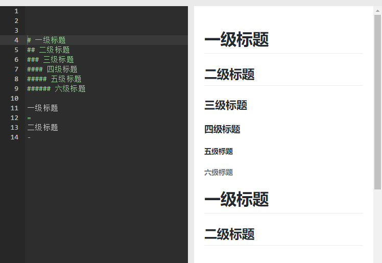

markdown是一种轻量级的标记语言，以纯文本形式编写，以html格式发布；[引用](https://www.jianshu.com/p/f3147a804368)

[1.标题](#1标题)  
[2.引用](#2引用)   
[3.字体](#3字体)  
[4.分割线](#4分割线)  
[5.超链接](#5超链接)   
[6.图片](#6图片)  
[7.列表](#7列表)  
[8.表格](#8表格)  
[9.代码](#9代码)  

[其他](#其他)  
[1.页内跳转和目录](#1页内跳转和目录)


### 1.标题
有两种方法来制作一个标题
1. `#` 可以用来表示1-6级标题。  
>`#`的数量就是标题的级数，`#`与标题之间要有一个空格

2. `=` or `-` 可以表示一级和二级标题  
>在标题之下添加`=` or `-`   




### 2.分段及引用
**换行与分段**  
>在一行后面添加两个空格会进行换行。  
两行之间增加空行会进行分段  

**引用**  
>在一段的第一个字符前加`>`，会将这一段进行强调，并显示为引用块。  
>tips:  
>1. 可以叠加多个`>`，进行嵌套的引用
>2. 只需要在一段的第一个字符前加`>`，但是也可以在所有行前加`>`，会显得更整洁


### 3.字体
**粗体**  
```
**word**        // 粗体
*word*          // 斜体
***word***      // 斜粗体
~~word~~        // 删除线
```
>**bold**  
>*italic*  
>***bold and italic***  
>~~delete~~  


### 4.分割线

使用三个及以上的`*, -, _`可以创建分割线

```
***
---
___
```
view:  
***
---
___

### 5.图片
```

```

### 6.超链接
行内式
>
>```
>[Text](Url)
>
>example:
>[baidu](https://baidu.com)
>```
>[baidu](https://baidu.com)


引用式
>```
>[label]:Url
>[Text][label]
>
>example:
>[bd]:https://baidu.com
>[baidu][bd]
>```
>
>[bd]:https://baidu.com
>[baidu][bd]
>
>引用式中被引用的label需要放在引用者前面；


### 7.列表
无序列表
> *, -, +  
> 以这三个符号开头的行会被视为无序列表
>
>```
>* one
>* two
>* two
>```
>view
>* one
>* two
>* two


有序列表
> 以数字开头的会被视为有序列表
>
>```
>3. one
>4. two
>22. three
>```
>view
>3. one
>4. two
>22. three
>
>可以以任意一个数字开头，但是后面的序号会从第一个数开始叠加，而不是自己声明的那个数字

### 8.表格
```
 head head head  | head head head |  head head head 
-- | --: | :--: 
body | body | body
body | body | body
```
view
 head head head  | head head head |  head head head 
-- | --: | :--: 
body | body | body
body | body | body

一个表格的表示由三个部分构成头部，内容，和对齐方式  
表格的列由`|`分割


### 9.代码
代码块  
>代码的前后由三个反引号包裹起来，就形成了代码块
```
    ```
    this is code
    ```
```
view  
```
this is code
```
行内代码
>行内代码的前后各有一个反引号，就形成了行内代码
```
    `inline code`
```
view  
`inline code`


## 其他
### 1.页内跳转和目录
显示的格式：
```
[显示内容](#标题)
```
注意：
1. []中括号填写需要在页面上显示的内容  
2. ()小括号内部声明跳转目标标题，以#开头，标题题号如果包含.、下划线直接忽略掉，标题文本中如果有**空格，使用-横杠符号替代**，标题文本中的大写字母转换成小写。
